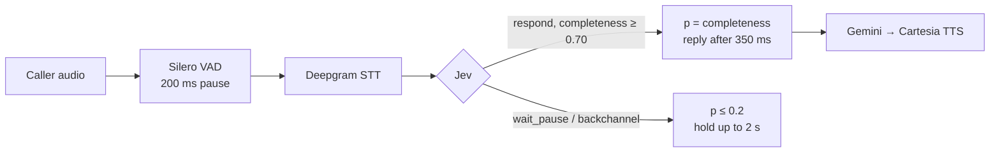

# voiceagent

A LiveKit phone-support voice agent that decides when the caller is done speaking
by asking [Jev](https://typesafe.ai) (Typesafe AI) instead of waiting out a fixed
silence timer.

## The problem

Most voice agents end a turn after N ms of silence. That forces a bad trade-off:

- **Short timeout** → the agent cuts people off mid-thought:
  *"My laptop keeps… um…"* → agent jumps in.
- **Long timeout** → every normal reply feels sluggish.
- **Backchannels** (*"yeah"*, *"uh-huh"*) said while the agent is talking get
  treated as a new turn, and the agent stops to answer them.

Silence duration is the wrong signal. Whether a turn is finished depends on
*what* was said and the conversation around it.

## The approach

When VAD reports a pause, the agent sends the partial transcript plus the last
few messages to Jev and asks two structured questions:

| Question | Type | Answers |
|---|---|---|
| `is_turn_complete` | noul (probability) | did the caller finish a substantive turn? |
| `turn_action` | choice | `respond` · `wait_pause` · `backchannel` |

Those answers become the end-of-turn probability LiveKit already knows how to use:



- Finished thought → the agent answers in ~350 ms.
- Filler, trailing clause or backchannel → the probability falls below LiveKit's
  `unlikely_threshold`, so it holds for up to 2 s and lets the caller continue.
- Jev slow, down or returning garbage → **fails open** to "respond". The worst
  case is the plain silence-based behavior, never a stuck agent.

The whole integration lives in [`src/voiceagent/jev_detector.py`](src/voiceagent/jev_detector.py)
and plugs into LiveKit's standard turn-detector protocol, so it swaps in for
LiveKit's built-in model with no other changes.

## Stack

| Layer | Choice |
|---|---|
| Transport / orchestration | LiveKit Agents |
| VAD | Silero |
| Turn detection | Jev (Typesafe AI) |
| STT | Deepgram Nova-3 |
| LLM | Gemini 2.5 Flash (via LiveKit Inference) |
| TTS | Cartesia Sonic-3 |

## Running it

Requires Python 3.13 and [uv](https://docs.astral.sh/uv/).

```bash
cp .env.example .env    # fill in keys
uv sync
uv run voiceagent dev   # connect from the LiveKit Agents Playground
```

## Development

```bash
uv run pytest
uv run ruff check . && uv run ruff format --check .
```

Tuning knobs:

- `RESPOND_THRESHOLD` and `HOLD_PROBABILITY` in `jev_detector.py`
- `endpointing.min_delay` / `max_delay` in `agent.py`
